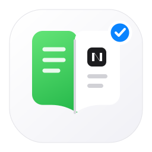
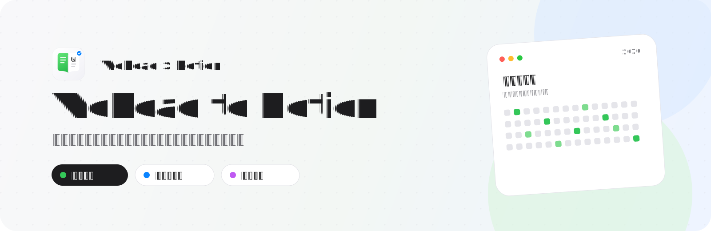
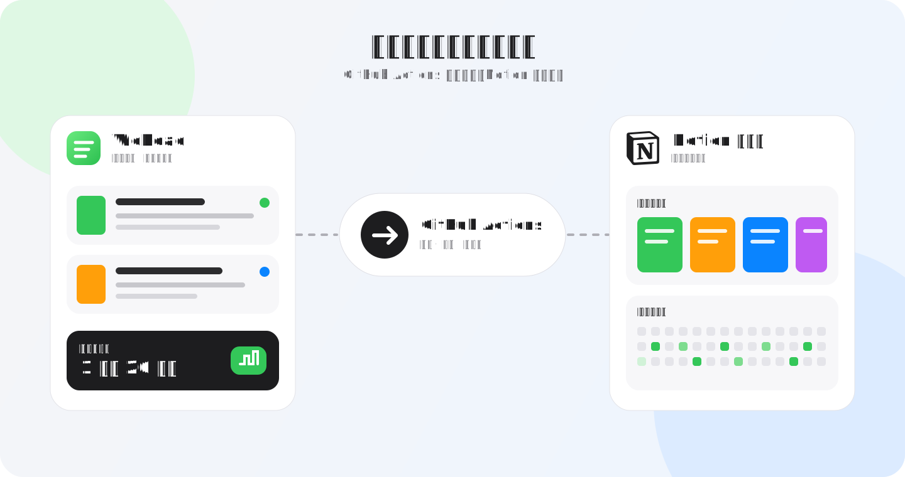
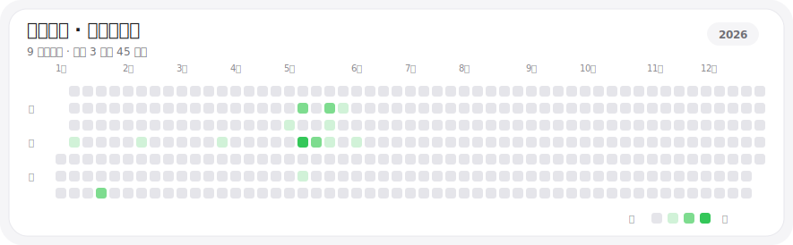
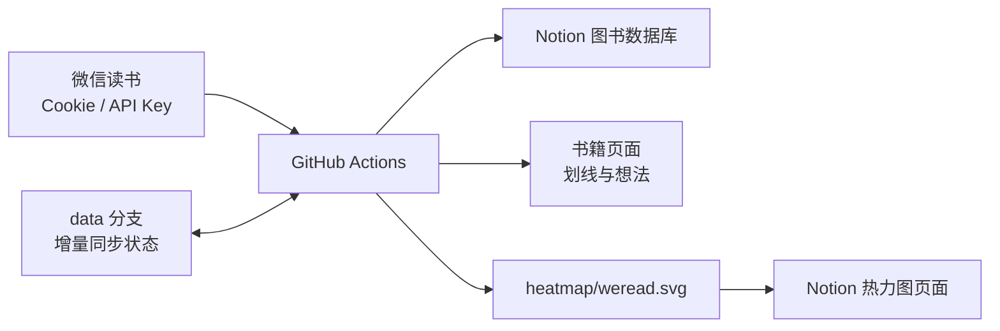

<p align="center">
  
</p>

<h1 align="center">WeRead to Notion</h1>

<p align="center">
  自动把微信读书中的书籍、划线、想法、阅读进度与阅读时长同步到 Notion，<br />
  持续构建一个属于自己的、可检索的数字图书馆。
</p>

<p align="center">
  
  
  <a href="https://github.com/zengyincen/weread-to-notion/commits/main"></a>
  <a href="https://github.com/zengyincen/weread-to-notion"></a>
  <a href="https://github.com/zengyincen/weread-to-notion/network/members"></a>
</p>

<p align="center">
  <a href="https://zengyincen.notion.site/bc53c0bb724d8388af60016cce930ea6">在线示例</a>
  ·
  <a href="https://sailor0913.notion.site/1f269034c78f8019af2dc928f665bca9?pvs=73">复制 Notion 模板</a>
  ·
  <a href="#quick-start">快速开始</a>
  ·
  <a href="#faq">常见问题</a>
</p>

<p align="center">
  
</p>

## 这是什么

微信读书很适合阅读，Notion 很适合整理。这个项目用 GitHub Actions 把两者连接起来：微信读书负责产生阅读记录，GitHub Actions 定时同步，Notion 则成为长期积累的知识库。

本项目基于 [sailor0913/weread-to-notion](https://github.com/sailor0913/weread-to-notion) 持续扩展，在原有书籍、划线与想法同步能力之外，增加了更完整的元数据、增量同步状态、用户导入书籍封面处理，以及可自动嵌入 Notion 的 Apple 风格阅读热力图。

<p align="center">
  
</p>

## 功能一览

| 能力 | 说明 |
| --- | --- |
| 📚 图书馆同步 | 同步微信读书中的书名、作者、译者、封面、分类、ISBN、出版社等信息 |
| ✍️ 划线与想法 | 将个人划线、想法写入对应的 Notion 书籍页面 |
| 📖 阅读进度 | 同步阅读状态、开始/完成日期、总时长和阅读进度 |
| 🧩 按章节整理 | 可选择按章节组织划线与想法，长书笔记更清晰 |
| 🎯 条件过滤 | 可按“已读 / 在读 / 未读”和作者组合筛选同步范围 |
| ⚡ 增量同步 | 保存每本书的同步水位，只处理新增或变化的数据 |
| 🗺️ 阅读热力图 | 生成固定文件 `heatmap/weread.svg`，并自动创建或更新 Notion 图片块 |
| 🎨 Apple 风格 | 热力图采用 SF 字体栈、圆角卡片、Apple Green 色阶与宽松行距 |
| 🖼️ 封面回退 | 用户导入书籍可选用 GitHub / Imgur 图床，并支持 Google Books、Open Library 回退 |
| 🤖 自动运行 | 图书馆与热力图使用独立 GitHub Actions，均支持定时和手动触发 |

## 效果预览

- [查看 Notion 在线示例](https://zengyincen.notion.site/bc53c0bb724d8388af60016cce930ea6)
- [复制原项目 Notion 模板](https://sailor0913.notion.site/1f269034c78f8019af2dc928f665bca9?pvs=73)

当前仓库生成的阅读热力图：

<p align="center">
  
</p>

## 工作原理



项目包含两个工作流：

| 工作流 | 文件 | 默认计划 | 用途 |
| --- | --- | --- | --- |
| WeRead to Notion Sync | `.github/workflows/sync.yml` | `0 8 * * *` | 同步书籍、元数据、划线、想法和阅读进度 |
| Read time sync | `.github/workflows/read-time-sync.yml` | `0 0 * * *` | 每天北京时间 08:00 生成热力图、提交 SVG 并更新 Notion 图片 |

> [!NOTE]
> GitHub Actions 的 cron 使用 UTC。`Read time sync` 的 `0 0 * * *` 对应北京时间 08:00；定时任务可能有数分钟延迟。

---

<a id="quick-start"></a>

## 快速开始

完整部署大约需要 10～20 分钟。建议在电脑端使用 Chrome 完成以下操作。

### 准备清单

- 一个 [Notion](https://www.notion.so/) 账号
- 一个 [GitHub](https://github.com/) 账号
- 已登录微信读书网页版的 Chrome 浏览器
- 本项目的 Fork

部署流程：

1. Fork 仓库并允许 GitHub Actions 写入内容。
2. 复制 Notion 模板，创建 Notion Integration。
3. 取得微信读书 Cookie；热力图推荐再配置官方 API Key。
4. 在 GitHub 中添加 Secrets 和 Variables。
5. 依次运行图书馆同步和热力图同步。

下面是每一步的详细说明。

---

## 一、Fork 仓库与 Actions 权限

### 1. Fork 项目

打开本仓库，点击右上角 **Fork → Create fork**：

```text
https://github.com/zengyincen/weread-to-notion
```

Fork 后的项目会位于你自己的 GitHub 账号下，后续 Secrets 也只需要配置在自己的 Fork 中。

如果你已经 Fork 过旧版本，先在仓库首页点击 **Sync fork → Update branch**，同步最新代码。GitHub Secrets 和 Variables 不会因为同步 Fork 而丢失；同步完成后重新运行一次两个工作流即可。

### 2. 开启工作流写权限

进入 Fork 后的仓库：

```text
Settings → Actions → General → Workflow permissions
```

选择：

```text
Read and write permissions
```

然后点击 **Save**。热力图工作流需要提交 `heatmap/weread.svg`，图书馆同步工作流需要维护 `data` 分支，因此不能只授予只读权限。

> [!IMPORTANT]
> Notion 通过公开的 `raw.githubusercontent.com` 地址读取热力图。若仓库是私有仓库，SVG 可以生成，但 Notion 无法直接加载该图片。希望自动嵌入 Notion 时，请保持 Fork 为公开仓库。

---

## 二、配置 Notion

### 1. 复制图书馆模板

打开 [Notion 模板](https://sailor0913.notion.site/1f269034c78f8019af2dc928f665bca9?pvs=73)，点击右上角 **Duplicate / 复制**，将模板复制到自己的 Workspace。

模板中包含图书数据库和同步配置表。优先使用模板可以避免属性名称或属性类型不一致。

### 2. 创建 Notion Integration

打开：

```text
https://www.notion.so/profile/integrations
```

然后：

1. 点击 **New integration / 新建集成**。
2. 名称可以填写 `WeRead to Notion`。
3. 选择刚才复制模板所在的 Workspace。
4. 确保内容权限允许读取、插入和更新页面。
5. 保存后点击 **Show / 显示**，复制 Integration Secret。

这个值稍后保存为 GitHub Secret：

```text
NOTION_INTEGRATIONS
```

不要把 Integration Secret 写进 README、Issue、代码或 `.env` 提交到 GitHub。

### 3. 把页面共享给 Integration

在 Notion 中打开刚复制的图书馆页面：

```text
页面右上角 ··· → Connections / 连接 → 选择 WeRead to Notion
```

至少要确保以下对象已共享给 Integration：

- 图书数据库所在页面
- 同步配置数据库所在页面（如果使用筛选功能）
- 准备用来展示热力图的页面

如果 Actions 日志出现 `object_not_found`、`Could not find database` 或 404，通常不是 ID 错误，而是页面没有共享给 Integration。

### 4. 获取 `DATABASE_ID`

在模板中打开真正的图书数据库视图，点击数据库右上角的 **··· → Copy link to view / 复制视图链接**。

链接通常类似：

```text
https://www.notion.so/your-space/xxxxxxxxxxxxxxxxxxxxxxxxxxxxxxxx?v=yyyyyyyyyyyyyyyyyyyyyyyyyyyyyyyy
```

`?v=` 之前的 32 位字符串是数据库 ID：

```text
xxxxxxxxxxxxxxxxxxxxxxxxxxxxxxxx
```

将它保存为 GitHub Secret：

```text
DATABASE_ID
```

> [!WARNING]
> 不要复制 `?v=` 后面的视图 ID，也不要复制最外层模板页面的 ID。必须从“图书数据库本身”的视图链接中获取。

### 5. 获取 `CONFIG_DATABASE_ID`（可选但推荐）

打开模板中的配置数据库，同样使用 **Copy link to view / 复制视图链接**，提取 `?v=` 前的 32 位数据库 ID。

将它保存为：

```text
CONFIG_DATABASE_ID
```

不配置该值时，程序会同步所有书籍，并使用默认的增量模式。

### 6. 获取 `HEATMAP_BLOCK_ID`

最简单的方式是直接填写“准备展示热力图的 Notion 页面 ID”：

1. 新建或打开一个 Notion 页面，例如“阅读数据”。
2. 将页面共享给同一个 Integration。
3. 点击 **Share → Copy link / 复制链接**。
4. 提取链接中的 32 位页面 ID。

保存为：

```text
HEATMAP_BLOCK_ID
```

脚本支持三种目标：

- 页面 ID（Notion API 返回 `child_page`）：自动查找热力图，没有就创建图片块。
- image 块 ID：直接更新现有图片块。
- embed 块 ID：直接更新现有嵌入块。

推荐填写页面 ID，不需要手动创建图片块。

### 7. 图书数据库属性

若不使用模板而是手工创建数据库，需要保持以下属性名称和类型完全一致：

| 属性名 | Notion 类型 | 用途 |
| --- | --- | --- |
| 书名 | Title | 页面标题 |
| 作者 | Rich text | 作者信息 |
| 译者 | Rich text | 译者信息 |
| 封面 | Files & media | 书籍封面 |
| ISBN | Rich text | ISBN |
| 出版社 | Rich text | 出版社 |
| 分类 | Rich text | 微信读书分类 |
| 阅读状态 | Select | 未读 / 在读 / 已读 |
| 开始阅读 | Date | 首次阅读日期 |
| 完成阅读 | Date | 完成阅读日期 |
| 阅读总时长 | Rich text | 格式化后的累计阅读时间 |
| 阅读进度 | Number | 0～100 的阅读进度 |

属性名或类型不一致会导致 Notion API 拒绝写入。

---

## 三、配置微信读书

### 1. 获取 `WEREAD_COOKIE`

推荐使用 Chrome：

1. 打开 [微信读书网页版](https://weread.qq.com/) 并扫码登录。
2. 打开开发者工具：Windows 按 `F12`，macOS 按 `Command + Option + I`。
3. 进入 **Network / 网络** 选项卡。
4. 刷新页面。
5. 选择一个发往 `weread.qq.com` 的请求；可先选择 **Doc** 过滤。
6. 在 **Request Headers / 请求标头** 中找到 `Cookie`。
7. 复制完整 Cookie 字符串。

保存为 GitHub Secret：

```text
WEREAD_COOKIE
```

Cookie 应包含 `wr_vid`、`wr_skey`、`wr_rt` 等字段。不要只复制其中一个值。

> [!TIP]
> 如果刷新后页面或开发者工具卡住，可先切换到 **Sources** 面板，暂停可能触发的断点，再重新刷新。Cookie 失效后，只需要重新登录并更新 GitHub Secret，不需要重新 Fork。

### 2. 获取 `WEREAD_API_KEY`（热力图推荐）

阅读热力图使用微信读书官方 Agent API。打开：

```text
https://weread.qq.com/r/weread-skills
```

登录后获取格式类似下面的 API Key：

```text
wrk-xxxxxxxx
```

保存为：

```text
WEREAD_API_KEY
```

这个值对图书笔记同步不是必需的，但对阅读统计接口最稳定。如果不配置，热力图脚本会尝试通过 `WEREAD_COOKIE` 自动获取 API Key。

本项目不再依赖 `github_heatmap` 的 `REFRESH_TOKEN / ACTIVATION_CODE / DEVICE_ID` 认证，因此不会走容易触发 `-2010 用户不存在` 的旧链路。

---

## 四、配置 GitHub Secrets

进入 Fork 后的仓库：

```text
Settings → Secrets and variables → Actions → Secrets
```

点击 **New repository secret**，按下面的表格逐项添加。

### 核心 Secrets

| Secret | 是否必填 | 用途 |
| --- | --- | --- |
| `WEREAD_COOKIE` | 是 | 访问微信读书网页接口；也可用于自动获取官方 API Key |
| `NOTION_INTEGRATIONS` | 是 | Notion Integration Secret |
| `DATABASE_ID` | 是 | Notion 图书数据库 ID |
| `CONFIG_DATABASE_ID` | 否 | Notion 同步配置数据库 ID；用于状态、作者、模式和章节设置 |
| `NOTION_VERSION` | 否 | Notion API 版本；默认 `2022-06-28` |

### 热力图 Secrets

| Secret | 是否必填 | 用途 |
| --- | --- | --- |
| `WEREAD_API_KEY` | 推荐 | 微信读书官方 API Key，格式 `wrk-...` |
| `HEATMAP_BLOCK_ID` | 嵌入 Notion 时必填 | Notion 页面、image 块或 embed 块 ID |
| `NOTION_TOKEN` | 否 | `NOTION_INTEGRATIONS` 的兼容别名；已有前者无需配置 |

### 用户导入书籍封面 Secrets

这部分全部可选。普通微信读书书籍不需要配置。

| Secret | 用途 |
| --- | --- |
| `GIT_TOKEN` | 把受限封面上传到 GitHub 图床；建议使用仅授予目标仓库 Contents 写权限的 fine-grained token |
| `GIT_REPO` | 图床位置，格式 `owner/repo` 或 `owner/repo/folder/path` |
| `IMGUR_CLIENT_ID` | GitHub 图床失败时使用 Imgur 上传 |

> [!CAUTION]
> Secrets 的名称区分大小写。不要在值两侧额外添加引号，也不要把 Secret 值放入 Repository Variables。

---

## 五、配置 GitHub Variables

进入：

```text
Settings → Secrets and variables → Actions → Variables
```

Variables 不包含敏感凭据，主要用于热力图展示。全部都是可选项。

| Variable | 默认值 | 说明 |
| --- | --- | --- |
| `YEAR` | 当前年份 | 热力图统计年份，例如 `2026` |
| `HEATMAP_NAME` | `微信读书` | 热力图标题前缀 |
| `HEATMAP_BACKGROUND_COLOR` | `#FFFFFF` | 铺满整个热力图卡片的纯白背景 |
| `HEATMAP_EMPTY_COLOR` | `#E5E5EA` | 无阅读记录的单元格 |
| `HEATMAP_LOW_COLOR` | `#D1F2D8` | 低阅读时长颜色 |
| `HEATMAP_MEDIUM_COLOR` | `#7EDC8F` | 中阅读时长颜色 |
| `HEATMAP_HIGH_COLOR` | `#34C759` | 高阅读时长颜色 |
| `HEATMAP_TEXT_COLOR` | `#1D1D1F` | 标题文字颜色 |

颜色必须使用完整的六位十六进制格式，例如：

```text
#34C759
```

工作流也兼容旧变量名 `background_color`、`dom_color`、`track_color`、`special_color`、`special_color2` 和 `text_color`，新部署建议统一使用 `HEATMAP_*`。

---

## 六、首次运行 GitHub Actions

### 1. 启用 Actions

打开仓库的 **Actions** 标签。如果 GitHub 显示工作流尚未启用，点击 **I understand my workflows, go ahead and enable them**。

### 2. 先同步图书馆

选择：

```text
WeRead to Notion Sync → Run workflow → Run workflow
```

第一次运行通常会：

- 创建或检出 `data` 分支。
- 检查 Notion 数据库字段和数据库版本。
- 执行一次全量同步。
- 保存每本书的划线和想法同步水位。

看到绿色对勾后，刷新 Notion 图书馆。如果书籍较多，Notion 客户端可能需要按 `Command + R` / `F5` 刷新。

### 3. 再生成热力图

选择：

```text
Read time sync → Run workflow → Run workflow
```

成功后会完成三件事：

1. 获取当年的每日阅读时长。
2. 生成并提交固定文件 `heatmap/weread.svg`。
3. 在 `HEATMAP_BLOCK_ID` 指定的 Notion 页面中创建或更新热力图。

如果没有设置 `HEATMAP_BLOCK_ID`，前两步仍会执行，只会跳过 Notion 更新。

---

## 七、使用同步配置表

配置数据库中应有一条标题为：

```text
同步配置
```

程序会读取这条记录中的以下属性：

| 属性 | 类型 | 可用值 / 说明 |
| --- | --- | --- |
| 名称 | Title | 必须为 `同步配置` |
| 阅读状态 | Multi-select | `已读`、`在读`、`未读`；选中哪些就同步哪些 |
| 作者 | Multi-select | 留空表示不限作者；作者名必须和微信读书中的作者完全一致 |
| 全量/增量 | Select | `增量` 或 `全量`，默认增量 |
| 按章节划线 | Select | `是` 或 `否`，默认否 |

### 筛选规则

阅读状态与作者使用 **AND** 逻辑：

```text
阅读状态匹配 AND 作者匹配
```

例如：

- 阅读状态选择“已读、在读”
- 作者选择“冯唐”

结果只会同步冯唐名下处于“已读”或“在读”的书籍。

阅读状态建议保留模板中的“已读、在读、未读”三个选项，不要修改名称。作者可以按需新增，但要与图书馆中的作者文本完全一致。

### 全量与增量

- **增量**：读取 `data` 分支中的 synckey，只处理新增或变化的划线与想法，适合日常运行。
- **全量**：忽略已有同步水位，重新读取全部内容，适合模板升级、排查缺失数据或重大配置变更。

当程序检测到数据库版本升级或必要字段缺失时，会自动清理旧同步状态并触发一次全量同步。

---

## 八、阅读热力图说明

### 数据与文件

- 数据来源：微信读书官方 Agent Gateway 的 `/readdata/detail`。
- 输出文件：`heatmap/weread.svg`。
- 时间单位：微信读书返回秒，SVG 中转换为分钟 / 小时展示。
- 时区：按 Asia/Shanghai 归一化每日数据。
- 更新频率：默认每天北京时间 08:00 运行一次。

### Notion 缓存处理

仓库中的文件名始终保持：

```text
heatmap/weread.svg
```

每次 Actions 提交后，Notion 图片 URL 使用对应提交 SHA。这样既不改变文件名，也能绕过 Notion 对旧图片 URL 的缓存。

### 页面与图片块复用

当 `HEATMAP_BLOCK_ID` 是页面 ID 时：

1. 第一次运行会在页面末尾创建一个外链图片块。
2. 后续运行会根据 `/heatmap/weread.svg` 路径找到同一图片块。
3. 更新现有图片，不会每次重复插入。

---

## 九、本地运行

### 1. 安装

```bash
git clone https://github.com/zengyincen/weread-to-notion.git
cd weread-to-notion
cp env.example .env
npm ci
```

编辑 `.env`，填入需要的环境变量。

### 2. 常用命令

```bash
# 同步全部书籍（默认增量）
npm run sync

# 强制全量同步
npm run sync:full

# 生成 heatmap/weread.svg
npm run heatmap

# 运行热力图测试
npm run test:heatmap

# TypeScript 编译检查
npm run build
```

同步单本书籍：

```bash
npx ts-node src/index.ts --bookId=你的书籍ID
```

本地更新 Notion 热力图时还需要提供公开图片 URL：

```bash
HEATMAP_URL="https://raw.githubusercontent.com/owner/repo/main/heatmap/weread.svg" \
npm run heatmap:notion
```

---

<a id="faq"></a>

## 常见问题

### Actions 提示 Cookie 失效

重新登录微信读书网页版，按“配置微信读书”一节重新复制完整 Cookie，然后更新仓库 Secret `WEREAD_COOKIE`。

### Notion 返回 `object_not_found` 或 404

确认：

1. ID 来自正确的数据库或页面。
2. 页面已经连接到 `NOTION_INTEGRATIONS` 对应的 Integration。
3. Integration 属于同一个 Workspace。

### Notion 提示缺少数据库属性

优先重新复制最新版模板。如果手工创建数据库，请逐项核对“图书数据库属性”表中的中文名称和类型。

### 热力图提示 `Failed to refresh token` 或 `-2010 用户不存在`

这是旧版 `github_heatmap` 的认证错误。本项目已经移除该依赖。请确认 Fork 已同步最新代码，并运行仓库内的 `Read time sync` 工作流。

### 已生成 SVG，但 Notion 没有显示

检查：

- 仓库是否公开。
- `HEATMAP_BLOCK_ID` 是否是正确页面 / 图片块 ID。
- 热力图页面是否共享给 Integration。
- `NOTION_INTEGRATIONS` 是否有插入和更新内容的权限。

### `HEATMAP_BLOCK_ID` 显示为 `child_page`

这是正常的页面类型。当前脚本支持页面 ID，会自动创建并复用热力图图片块，不需要换成图片块 ID。

### GitHub 无法提交 `heatmap/weread.svg` 或 `data` 分支

进入：

```text
Settings → Actions → General → Workflow permissions
```

选择 **Read and write permissions**。如果主分支启用了严格保护规则，还需要允许 GitHub Actions 写入，或调整对应规则。

### 定时任务没有准点运行

GitHub Actions 的 schedule 不是实时调度器，高峰期可能延迟。需要立即同步时，直接使用 **Run workflow** 手动触发。

### 用户导入书籍封面不显示

受限封面可能无法被 Notion 直接访问。可配置 `GIT_TOKEN + GIT_REPO` 或 `IMGUR_CLIENT_ID`。如果图床失败，程序还会尝试 Google Books 和 Open Library 的公开封面。

### `data` 分支是什么，可以删除吗

`data` 分支保存增量同步水位和数据库版本。删除后不会影响主分支代码，但下一次运行会重新创建，并可能进行全量同步。通常不建议删除。

---

## 安全建议

- 不要把 Cookie、Notion Secret、微信读书 API Key 或 GitHub Token 提交到仓库。
- 不要在公开 Issue 或 Actions 日志中粘贴完整凭据。
- 如果凭据意外泄露，请立即重新生成或撤销。
- `GIT_TOKEN` 使用最小权限，只授权需要存放封面的仓库。
- 定期检查 Actions 日志；微信读书 Cookie 失效后及时更新。

---

## 致谢

- [weread-to-notion](https://github.com/sailor0913/weread-to-notion)
- [obsidian-weread-plugin](https://github.com/zhaohongxuan/obsidian-weread-plugin)
- [weread2notion](https://github.com/malinkang/weread2notion)
- [sailor0913/weread-to-notion](https://github.com/sailor0913/weread-to-notion)

如果这个项目对你有帮助，欢迎 Star、Fork 或提交 Issue～
